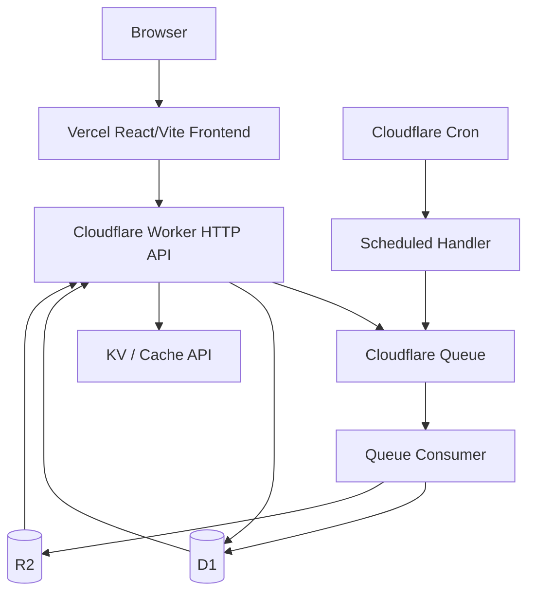
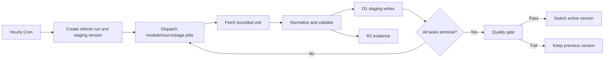

# MediaHub Vercel + Cloudflare Architecture Refactor Design

Date: 2026-07-11
Project: MediaHub
Status: Approved design direction, pending user review of written spec

## 1. Background

MediaHub is a JSON-first ranking dashboard for drama, novel, anime, and comic content. The current repository uses React/Vite/TypeScript on the frontend, Express 5 with JavaScript ESM on the backend, local JSON datasets, Node SQLite, process-local administrator sessions, and Node-based crawling and refresh services.

The current design assumes a long-running Node process and durable local disk. That conflicts with Vercel and Cloudflare Workers because production local files are not durable shared storage, a local SQLite file cannot be shared across isolates, process-memory sessions disappear, and long crawling jobs cannot remain attached to HTTP requests. Business services also directly access Node modules, environment variables, files, SQLite, or process-local queues.

## 2. Confirmed Decisions

1. Deploy the React/Vite frontend to Vercel.
2. Deploy the production API, storage, cache, scheduler, and durable tasks to Cloudflare.
3. Automatically collect and refresh real ranking data in production.
4. Refresh once per hour.
5. Migrate incrementally: Express remains the local adapter and Worker becomes the production adapter.
6. Keep public API behavior compatible during migration.
7. Keep the last valid published dataset whenever a refresh is incomplete or invalid.

## 3. Goals

1. Replace production filesystem, SQLite, memory-session, and in-process-queue assumptions with Cloudflare-native services.
2. Preserve correct ranking, normalization, search, ingestion, and response behavior.
3. Run refreshes as durable, partitioned, retryable background jobs.
4. Publish immutable dataset versions through an atomic active-version switch.
5. Keep Express and local adapters for development and offline debugging.
6. Establish domain, application, port, delivery, and infrastructure boundaries.
7. Share API contracts and adapter contract tests between Express and Worker.
8. Support independent rollback of frontend code, Worker code, and published data.

## 4. Non-goals

1. Do not rewrite the backend in one release or remove Express immediately.
2. Do not convert every backend file to TypeScript at once.
3. Do not redesign the dashboard during infrastructure migration.
4. Do not introduce a dedicated search cluster at the current scale.
5. Do not use KV as authoritative task, content, session, or dataset storage.
6. Do not run a complete crawl synchronously in an HTTP request or one Cron handler.
7. Do not permit arbitrary Vercel Preview origins to perform administrator writes.

## 5. Considered Approaches

### 5.1 Recommended: Hexagonal Core with Dual Adapters

Extract platform-independent domain and application logic behind repository, queue, cache, evidence, session, configuration, clock, and ID ports. Keep Express with SQLite/JSON as local adapters. Add Worker with D1/R2/KV/Queue adapters for production.

Benefits:

- Route-by-route and repository-by-repository migration.
- Reuse of normalization, scoring, ranking, and response logic.
- Continuous local development support.
- No Cloudflare types in business use cases.
- Replaceable, contract-tested infrastructure.

Costs:

- Express and Worker coexist during migration.
- Explicit ports and dependency construction are required.
- Existing services must be separated from environment, file, and SQLite access.

### 5.2 Alternative: Worker Read API with External CI Crawlers

Run Node crawlers from GitHub Actions or another runner and upload data to Cloudflare. This is a valid fallback for an incompatible crawler but not the target architecture because refresh status and credentials would span two operational platforms.

### 5.3 Rejected: Immediate Full Worker Rewrite

A one-step rewrite offers a uniform end state but creates the largest regression surface and conflicts with the approved incremental strategy.

## 6. Target Deployment Topology



Vercel hosts only the built Vite frontend, SPA fallback, production/preview deployments, frontend variables, and static assets. The browser calls a Cloudflare API custom domain directly.

```text
Web: https://media.example.com
API: https://api.example.com
VITE_API_BASE_URL=https://api.example.com
```

One Worker project provides HTTP, scheduled, and Queue entry paths. Starting a refresh creates a run, enqueues work, and immediately returns a `runId`.

## 7. Runtime and Dependency Boundaries

Domain and application code must not import Express, Hono context types, `node:fs`, `node:path`, `node:sqlite`, Cloudflare bindings, or `process.env`.

```text
Express / Worker / Cron / Queue delivery adapters
                       ↓
             Application use cases
                       ↓
                 Port contracts
                       ↑
SQLite / JSON / D1 / R2 / KV / Queue infrastructure adapters
```

Required ports include `ContentRepository`, `RankingRepository`, `DatasetRepository`, `RefreshRepository`, `EvidenceStore`, `TaskQueue`, `CacheStore`, `SessionStore`, `SourceFetcher`, `Clock`, `Logger`, and `IdGenerator`.

Configuration is validated at the runtime entry point and injected into use cases. Node loads configuration from `process.env`; Worker loads ordinary values from bindings and secrets from Worker Secrets.

## 8. Data Responsibilities

### 8.1 D1: Authoritative Structured State

D1 is the source of truth for content identities, metric history, ranking entries, dataset versions, search aliases, refresh runs/tasks, ingestion cursors, administrator sessions, audit logs, and system state.

Core tables:

```text
contents
content_metrics
content_sources
dataset_versions
ranking_entries
search_aliases
refresh_runs
refresh_tasks
ingestion_cursors
admin_sessions
admin_audit_logs
system_state
```

The existing SQLite schema is not copied mechanically. Stable content, metric history, evidence, ranking snapshots, and tasks have different lifecycles and query patterns.

### 8.2 R2: Immutable Objects

R2 stores published JSON modules, manifests, historical snapshots, raw evidence, and failed responses:

```text
datasets/{version}/drama.json
datasets/{version}/novel.json
datasets/{version}/anime.json
datasets/{version}/comic.json
datasets/{version}/manifest.json
evidence/{runId}/{taskId}.json
failures/{runId}/{taskId}.json
```

Published objects are immutable. Rollback switches the active version instead of overwriting objects.

### 8.3 KV and Cache API: Derived Cache Only

Cache keys contain the dataset version:

```text
dashboard:{version}
ranking:{module}:{version}:page:{page}:limit:{limit}
content:{contentId}:{version}
search:{version}:{queryHash}:page:{page}
```

Publishing creates new keys; old keys expire naturally. Initial TTLs are 5-10 minutes for dashboard, 10-15 minutes for rankings/search, 30-60 minutes for detail, and 6-24 hours for categories. Admin and task-status APIs are not publicly cached.

## 9. D1 Data Model

### 9.1 Stable Content and Metrics

```sql
CREATE TABLE contents (
  id TEXT PRIMARY KEY,
  type TEXT NOT NULL,
  title TEXT NOT NULL,
  normalized_title TEXT NOT NULL,
  description TEXT,
  author TEXT,
  copyright_owner TEXT,
  release_date TEXT,
  cover_url TEXT,
  content_url TEXT,
  metadata_json TEXT NOT NULL DEFAULT '{}',
  created_at TEXT NOT NULL,
  updated_at TEXT NOT NULL
);

CREATE INDEX idx_contents_type_updated ON contents(type, updated_at DESC);
CREATE INDEX idx_contents_normalized_title ON contents(normalized_title);

CREATE TABLE content_metrics (
  id INTEGER PRIMARY KEY AUTOINCREMENT,
  content_id TEXT NOT NULL,
  platform TEXT NOT NULL,
  metric_type TEXT NOT NULL,
  metric_value REAL NOT NULL,
  observed_at TEXT NOT NULL,
  source_url TEXT,
  FOREIGN KEY (content_id) REFERENCES contents(id)
);

CREATE INDEX idx_metrics_content_observed
  ON content_metrics(content_id, observed_at DESC);
```

Metric history supports real daily changes and trends without overwriting observations.

### 9.2 Dataset Versions and Rankings

```sql
CREATE TABLE dataset_versions (
  version TEXT PRIMARY KEY,
  status TEXT NOT NULL,
  trigger_type TEXT NOT NULL,
  item_count INTEGER NOT NULL DEFAULT 0,
  quality_json TEXT NOT NULL DEFAULT '{}',
  started_at TEXT NOT NULL,
  completed_at TEXT,
  published_at TEXT
);

CREATE TABLE ranking_entries (
  dataset_version TEXT NOT NULL,
  module TEXT NOT NULL,
  content_id TEXT NOT NULL,
  rank INTEGER NOT NULL,
  score REAL NOT NULL,
  trend_delta INTEGER,
  ranking_data_json TEXT NOT NULL DEFAULT '{}',
  PRIMARY KEY (dataset_version, module, content_id)
);

CREATE INDEX idx_ranking_module_version_rank
  ON ranking_entries(dataset_version, module, rank);

CREATE TABLE system_state (
  key TEXT PRIMARY KEY,
  value TEXT NOT NULL,
  updated_at TEXT NOT NULL
);
```

`system_state.active_dataset_version` identifies the only public version.

### 9.3 Search

The first migration uses normalized titles and explicit aliases rather than relying on Chinese FTS behavior:

```sql
CREATE TABLE search_aliases (
  alias_normalized TEXT NOT NULL,
  content_id TEXT NOT NULL,
  alias_type TEXT NOT NULL,
  weight INTEGER NOT NULL DEFAULT 0,
  PRIMARY KEY (alias_normalized, content_id)
);

CREATE INDEX idx_search_alias_normalized ON search_aliases(alias_normalized);
```

Search order is exact title, exact alias, title prefix, alias prefix, bounded fuzzy matching, then alias weight, heat, and recency. A dedicated search service is deferred until scale and measured latency justify it.

## 10. Hourly Refresh Workflow



Refresh runs and tasks are durable:

```sql
CREATE TABLE refresh_runs (
  run_id TEXT PRIMARY KEY,
  dataset_version TEXT NOT NULL,
  trigger_type TEXT NOT NULL,
  status TEXT NOT NULL,
  expected_tasks INTEGER NOT NULL DEFAULT 0,
  completed_tasks INTEGER NOT NULL DEFAULT 0,
  failed_tasks INTEGER NOT NULL DEFAULT 0,
  started_at TEXT NOT NULL,
  completed_at TEXT,
  error_summary TEXT
);

CREATE TABLE refresh_tasks (
  task_id TEXT PRIMARY KEY,
  idempotency_key TEXT NOT NULL UNIQUE,
  run_id TEXT NOT NULL,
  module TEXT NOT NULL,
  source TEXT NOT NULL,
  cursor TEXT,
  status TEXT NOT NULL,
  attempt INTEGER NOT NULL DEFAULT 0,
  item_count INTEGER NOT NULL DEFAULT 0,
  available_at TEXT,
  started_at TEXT,
  completed_at TEXT,
  last_error TEXT
);

CREATE INDEX idx_refresh_tasks_run_status
  ON refresh_tasks(run_id, status);
```

Task states:

```text
pending -> queued -> running -> succeeded
                       |-> retry_wait -> queued
                       |-> dead_letter
                       |-> failed
```

The idempotency key is `{runId}:{module}:{source}:{cursor}`. Queue consumers conditionally acquire a task and acknowledge an already-completed key without repeating writes. One message processes one bounded source/module/page unit; the scheduler never executes the whole crawl.

## 11. Quality Gate and Publishing

A staging version is published only when mandatory tasks are terminal and quality checks pass. Checks include minimum module counts, title/metric/URL/evidence completeness, invalid or zero metric rates, unexpected count collapse, unexpected complete Top-10 replacement, previous-version difference, and mandatory-source coverage.

Publishing atomically marks the version published, updates `active_dataset_version`, and records an audit event. A failed version is rejected while the old active version remains visible. Partial staging rows are never returned by public APIs.

## 12. Administrator Security

Production replaces the process-local session `Map` with D1 sessions:

```sql
CREATE TABLE admin_sessions (
  token_hash TEXT PRIMARY KEY,
  created_at TEXT NOT NULL,
  expires_at TEXT NOT NULL,
  last_seen_at TEXT,
  revoked_at TEXT,
  ip_hash TEXT,
  user_agent_hash TEXT
);
```

The cookie contains only a random token; D1 stores its hash. Cookie properties are `HttpOnly`, `Secure`, `SameSite=Lax`, `Path=/`, and a 12-hour maximum age.

Security requirements:

1. Store administrator password hash, webhook secrets, and upstream credentials as Worker Secrets.
2. Replace simple SHA-256 password verification with PBKDF2 or an equivalent runtime-supported password derivation scheme.
3. Rate-limit failed logins by privacy-preserving IP hash and time window.
4. Audit login, logout, refresh, retry, cancellation, and publication actions.
5. Require valid session, exact Origin, CSRF token, and explicit admin-action header for writes.
6. Permit Vercel Preview to call public read APIs but not admin writes unless one exact preview origin is temporarily allowlisted.

## 13. API Contracts

Keep the existing success envelope compatible:

```json
{ "code": 0, "data": {}, "requestId": "req_xxx" }
```

Use a stable error envelope:

```json
{
  "code": 1004,
  "error": { "type": "not_found", "message": "Content not found" },
  "requestId": "req_xxx"
}
```

Public routes remain:

```text
GET /api/health
GET /api/categories
GET /api/contents
GET /api/contents/:id
GET /api/contents/discover/grouped
```

Admin routes include login, logout, and session status. Refresh routes become asynchronous:

```text
POST /api/ingestion/refresh-all
GET  /api/ingestion/runs
GET  /api/ingestion/runs/:runId
POST /api/ingestion/runs/:runId/retry
POST /api/ingestion/runs/:runId/cancel
```

Starting a refresh returns `{ runId, status: "queued" }`; the Admin frontend polls run status.

## 14. Code Organization and Language Strategy

Initially introduce boundaries under the existing backend:

```text
backend/src/
├─ core/
│  ├─ domain/
│  ├─ application/
│  ├─ ports/
│  └─ errors/
├─ adapters/
│  ├─ express/
│  └─ local/
├─ services/       # not yet migrated
└─ repositories/   # not yet migrated
```

Add a new Worker workspace:

```text
worker/
├─ package.json
├─ tsconfig.json
├─ wrangler.jsonc
├─ migrations/
└─ src/
   ├─ index.ts
   ├─ env.ts
   ├─ http/
   ├─ scheduled/
   ├─ queue/
   └─ adapters/
```

After boundaries stabilize, shared TypeScript code may move to `packages/contracts`, `packages/domain`, and `packages/application`.

Worker and new contracts use TypeScript. Existing Express JavaScript remains valid during early phases. A legacy file is converted when its responsibilities are extracted, not through a repository-wide extension change. Hono may be used as a thin Worker routing adapter, but Hono types cannot appear in core signatures.

### 14.1 Targeted Complexity Improvements

| File | Approximate size | Target split |
| --- | ---: | --- |
| `leaderboardRepository.js` | 899 lines | snapshots, events, queries |
| `catalogService.js` | 714 lines | retrieval, cache, relation assembly |
| `contentRepository.js` | 670 lines | read, write, search |
| `ingestionService.js` | 632 lines | orchestration, collection, normalization, persistence |
| `hotDatasetService.js` | 530 lines | dataset I/O and transformation |
| `frontend/src/index.css` | 3879 lines | tokens, base, components, pages, animations |
| `real-hot-dataset-catalog.mjs` | 11969 lines | static records moved to JSON |

The catalog becomes:

```text
data/catalog/drama.json
data/catalog/novel.json
data/catalog/anime.json
data/catalog/comic.json
```

Only refactors that support a migrated platform boundary are included; unrelated rewrites remain out of scope.

## 15. Testing Strategy

1. Preserve current backend, frontend, API contract, and Playwright tests as the baseline.
2. Add platform-free unit tests for normalization, ranking, quality gates, task transitions, idempotency, cache keys, and publication.
3. Run shared repository contract suites against SQLite/JSON and D1/R2 adapters.
4. Run one API contract suite against Express and Worker.
5. Use the Cloudflare Workers Vitest integration for Worker runtime and bindings.
6. Keep two E2E modes: local Vite+Express and Vercel Preview+Worker staging.
7. Keep production smoke tests read-only by default.

## 16. Deployment Configuration

### 16.1 Vercel

```text
Root Directory: frontend
Build Command: npm run build
Output Directory: dist
Install Command: npm ci
```

Add SPA fallback and immutable cache headers for hashed assets. Production and Preview use different `VITE_API_BASE_URL` values.

### 16.2 Cloudflare

`wrangler.jsonc` binds one D1 database, R2 bucket, optional KV namespace, refresh Queue, DLQ, hourly Cron (`0 * * * *`), observability, and SQL migrations per environment.

Local, staging, and production never share databases, buckets, namespaces, queues, administrator secrets, or webhook secrets.

## 17. Migration Phases

### Phase 0: Baseline and Contracts

Run all tests, freeze the API contract, record dataset counts/quality, endpoint latency, and frontend bundle size. Do not redesign the UI during migration.

Exit criterion: baseline tests pass and API behavior is documented.

### Phase 1: Core and Port Extraction

Add configuration, clock, logger, ID generation, and storage/task contracts. Wrap current SQLite and JSON behavior in local adapters. Move selected orchestration into application use cases while preserving Express behavior.

Exit criterion: the first migrated Express route uses a core use case with all tests green.

### Phase 2: Worker Read API

Add Worker workspace, staging bindings, D1 migrations, validated dataset import, and public health/categories/list/detail/search/dashboard routes. Run shared API contracts against Express and Worker.

Exit criterion: Vercel Preview completes all public read flows against Worker staging.

### Phase 3: Durable Refresh Pipeline

Add refresh tables, hourly scheduler, Queue dispatch, bounded crawler tasks, idempotency, retries, DLQ, R2 evidence, staging validation, and atomic publishing.

Exit criterion: consecutive hourly staging runs succeed or safely retain the previous version when they fail.

### Phase 4: Administrator Migration

Add D1 sessions, secure cookies, password derivation, throttling, CSRF, audit logs, async refresh creation, progress, retry, and cancellation behavior.

Exit criterion: production-style admin flows pass security and API contract tests in staging.

### Phase 5: Production Cutover

Configure custom domains, deploy production candidates, gradually route traffic, and observe API errors, D1 latency, Queue backlog, task success, publication delay, and upstream throttling. Keep the prior production path available during the observation window.

### Phase 6: Production-local State Cleanup

Remove production dependencies on local SQLite, writes to `data/current`, local snapshots, process-memory sessions, process-memory queues, and the long-running Node scheduler. Preserve local adapters for development.

## 18. Observability and Operations

Structured logs include `requestId`, `runId`, `taskId`, module, source, attempt, duration, result, and active/staging versions. Alert on missing hourly runs, Queue backlog, DLQ arrival, rejected datasets, publication delays, and repeated upstream authentication/rate-limit/parsing failures.

Existing webhook notifications are exposed behind a notification port rather than called directly from core use cases.

## 19. Rollback Strategy

1. Frontend: promote the previous Vercel production deployment.
2. Worker: restore the previous Worker deployment/version.
3. Data: set `active_dataset_version` to a previously published immutable version.

A failed staging refresh does not require code rollback because the prior dataset remains active.

## 20. Acceptance Criteria

The migration is complete when:

1. Vercel serves all frontend routes with SPA fallback.
2. Worker serves all production API routes.
3. API contract tests pass against Express and Worker.
4. Production no longer writes local SQLite or JSON datasets.
5. Hourly Cron dispatches partitioned Queue tasks.
6. Duplicate Queue delivery cannot duplicate content, metrics, or task completion.
7. Failed/partial refreshes cannot replace the active dataset.
8. D1 contains authoritative business and task state.
9. R2 contains immutable manifests, snapshots, and evidence.
10. KV/Cache API contains derived cache only.
11. Admin sessions survive isolate changes and can be revoked.
12. Production secrets use Worker Secrets.
13. Vercel Preview cannot perform admin writes by default.
14. Frontend, Worker, and active data roll back independently.
15. Local Express development remains supported.

## 21. Official Platform References

- Cloudflare Workers limits: https://developers.cloudflare.com/workers/platform/limits/
- Cloudflare Cron Triggers: https://developers.cloudflare.com/workers/configuration/cron-triggers/
- Cloudflare Queues: https://developers.cloudflare.com/queues/
- Cloudflare D1: https://developers.cloudflare.com/d1/
- Cloudflare R2: https://developers.cloudflare.com/r2/
- Cloudflare KV consistency: https://developers.cloudflare.com/kv/concepts/how-kv-works/
- Cloudflare Worker Secrets: https://developers.cloudflare.com/workers/configuration/secrets/
- Cloudflare Workers Vitest integration: https://developers.cloudflare.com/workers/testing/vitest-integration/
- Wrangler configuration: https://developers.cloudflare.com/workers/wrangler/configuration/
- Vercel Vite deployments: https://vercel.com/docs/frameworks/frontend/vite
- Hono on Cloudflare Workers: https://hono.dev/docs/getting-started/cloudflare-workers
